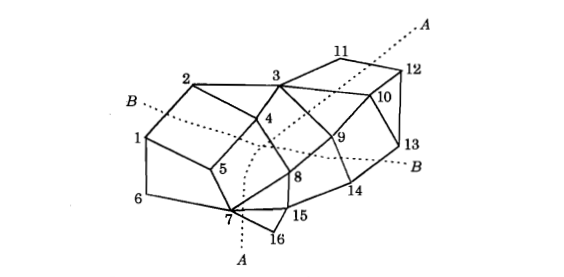
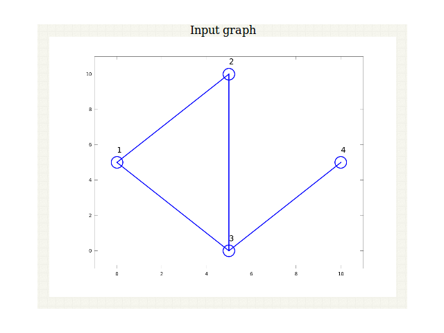
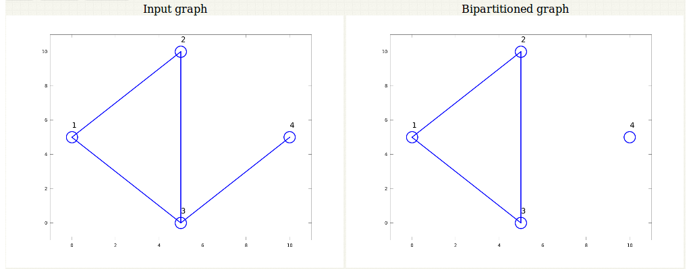
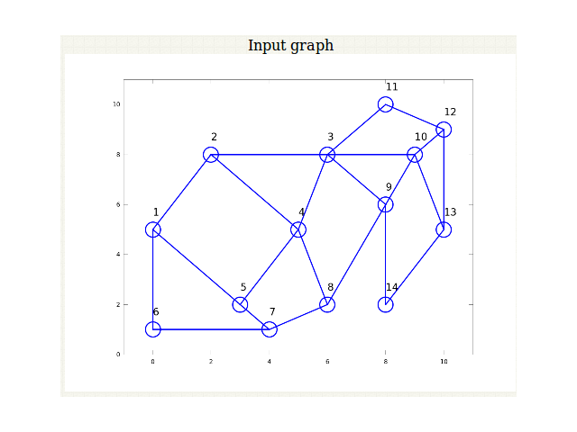
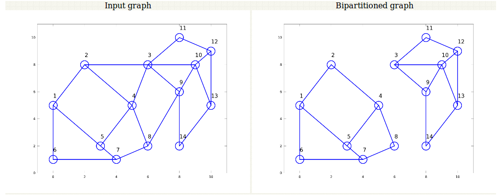

#### Graph bipartition problem

The problem illustrated here is the graph bipartition problem, using Hopfield model to solve it. The problem is to partition a given graph of \(N\) nodes equally, as shown in the following figure, such that the connectivity (measured in the terms of the number of links) between the two partitioned graphs is minimum.

**Figure 1**: *Graph bipartition problem*

Th	 e problem can be mapped onto a Hopfield network, in which each bipolar unit corresponds to a node in the graph, with the state \(s_i = +1\) representing the node in one half and state \(s_i = -1\) representing the nodes in the other half. Let state \(c_{ij} = 1\) if the nodes i and j are connected and \(c_{ij} = 0\) if the nodes are not connected. Thus the cost term \(c_{ij}s_i s_j\) contributes to a non-zero value only if the nodes are connected. We have \(c_{ij}s_i s_j = +1\) if the nodes are in the same partition, and \(c_{ij}s_i s_j = -1\) if they are in different partitions. For equal division of the nodes \(\sum\limits_{j} s_i=0\). Therefore the cost term with equality constraint is given by

                \( E = -\frac{1}{2}\)\(\sum\limits_{i,j}c_{ij}s_i s_j + \frac{\alpha}{2} [\sum\limits_{i}s_i]^2 \qquad(1)\) 

where the positive constant \(\alpha\) is used to indicate the relative strengths of the two terms in the energy function. Due to conflicting requirements of the two terms, there will be several minima in the energy function. The cost functions E can be written in the Hopfield energy form as

                \( E = -\frac{1}{2}\)\( \sum\limits_{ij}w_{ij}s_i s_j + \frac{N\alpha}{2} \qquad(2)\) 

where \(w_{ij} = c_{ij}- \alpha\). The term \(N\alpha/2\) is to take care of the term corresponding to \(i=j\), since \(w_{ii} = 0\) for a Hopfield Model.

The Hopfield model for the solution of graph bipartition problem is discussed here. While performing this experiment it is necessary to understand the issues associated with annealing of Hopfield model.

**Figure 2**: *Illustration of graph with 4 nodes before annealing.*

Figure 2 illustrates a graph with 4 nodes before the process of annealing. Figure 2 shows the input graph and the bipartitioned graph.

**Figure 3**: *Illustration of graph with 4 nodes after annealing.*

We see that even if there exists a solution through annealing, it need not lead to the optimum solution of the bipartition. The graph still is not divided in parts containing equal number of nodes as illustrated in Figure 3.

**Figure 4**: *Illustration of graph with 14 nodes before annealing.*

Figure 4 illustrates a graph with 14 nodes before the process of annealing. Figure 5 shows the input graph and the bipartitioned graph.

**Figure 5**: *Illustration of graph with 14 nodes after annealing.*

We see that in the case of more number of nodes, annealing leads to the optimum solution of the bipartition. The graph still is now divided in parts containing equal number of nodes as illustrated in Fig. 5.

